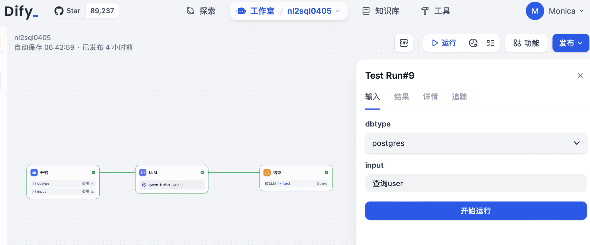
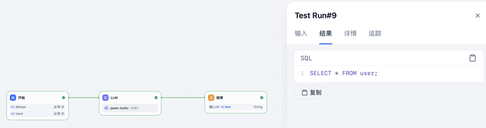

# nl2sql_demo
This is a demo for NL to SQL with AI in sevaral ways:

- dify workflow + agent + sql excution backend + postgres
  - configure workflow, with LLM to process natural language and generate sql statements(can fine tune the LLM for DB only)


  Current workflow:

  
  
  
  - create agent to send sql to a backend server - TBD
  - create a sql excution server(inclduing OPEN API swagger) to connect to database and excute the sql statments - TBD
  - setup the database(postgres in this demo) - TBD

- langchain + create_sql_agent + postgres

  - This demo is hard coding the end-user question now, and do database query with langchain + create_sql_agent and response with correct data as following: 

```
 Entering new SQL Agent Executor chain...
Action: sql_db_list_tables
Action Input: userI should query the schema of the user table.
Action: sql_db_schema
Action Input: user
CREATE TABLE "user" (
	username TEXT, 
	realname TEXT
)

/*
3 rows from user table:
username	realname
Monica	Li Jia
meng	meng
*/I should construct a query to select all relevant columns from the user table, limiting the results to 10 entries.
Action: sql_db_query_checker
Action Input: SELECT username, realname FROM "user" LIMIT 10;SELECT username, realname FROM "user" LIMIT 10;The query is correct. I will now execute it.
Action: sql_db_query
Action Input: SELECT username, realname FROM "user" LIMIT 10;[('Monica', 'Li Jia'), ('meng', 'meng')]I now know the final answer.
Final Answer: 以下是 "user" 表中的一些数据：

| username | realname |
|----------|----------|
| Monica   | Li Jia   |
| meng     | meng     |

注意：仅显示了前10条记录。

> Finished chain.
========打印结果
{'input': '查询所有user', 'output': '以下是 "user" 表中的一些数据：\n\n| username | realname |\n|----------|----------|\n| Monica   | Li Jia   |\n| meng     | meng     |\n\n注意：仅显示了前10条记录。'}

```
  - Next Step
    - create a service to get user question
    - create a console with React to communicate with end user