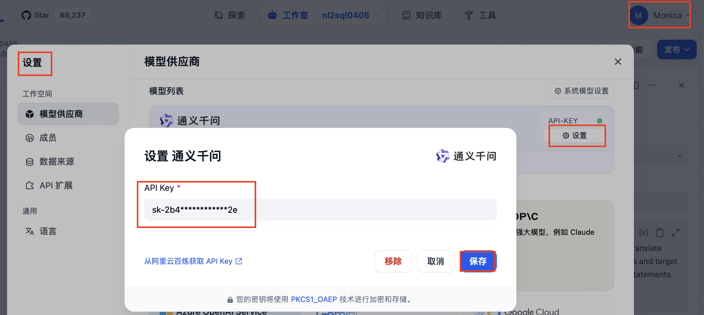

How to Set Up dify for NL2SQL in Mac


### Steps
0. install docker
1. setup dify by following: https://docs.dify.ai/zh-hans/getting-started/install-self-hosted/docker-compose
2. setup postgres in dify docker compose file, add following lines under `services` section

```
# The postgres database.
  db-data:
    image: postgres:15-alpine  
    container_name: postgresql_db_04  # 指定容器名称
    environment:
      POSTGRES_USER: root
      POSTGRES_PASSWORD: xxxxx
      POSTGRES_DB: demo
    ports:
      - "5432:5432"  # 将容器的5432端口映射到主机的5432端口
```

   - Login to postgres container, run following cmd for a test

```
psql -U root -W data


CREATE TABLE public."user"
(
    username text,
    realname text
);

ALTER TABLE IF EXISTS public."user"
    OWNER to root;
```
  - Install pgAdmin(optional), follow the instruction here: https://www.pgadmin.org/download/

  

    - import data (TBD)

- create workflow
  - configure LLM API key(这里使用通义千问)
   
  - create workflow
  
  
  
- create web service to do sql excution(TBD)
- create agent in dify
